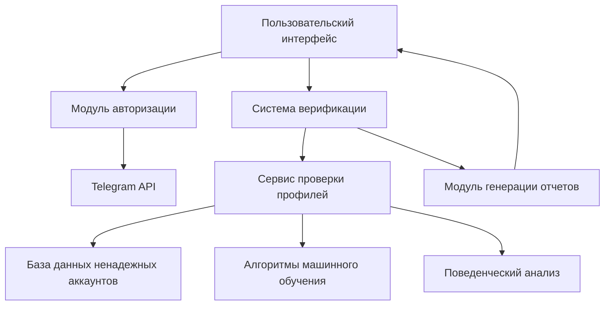
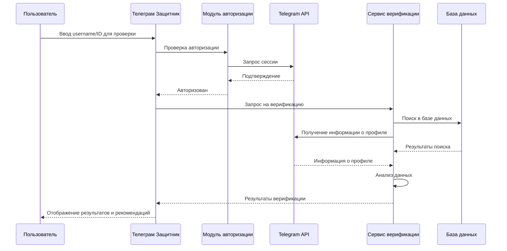
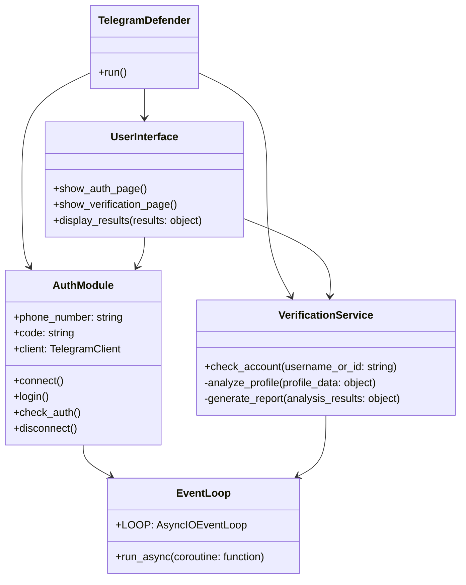
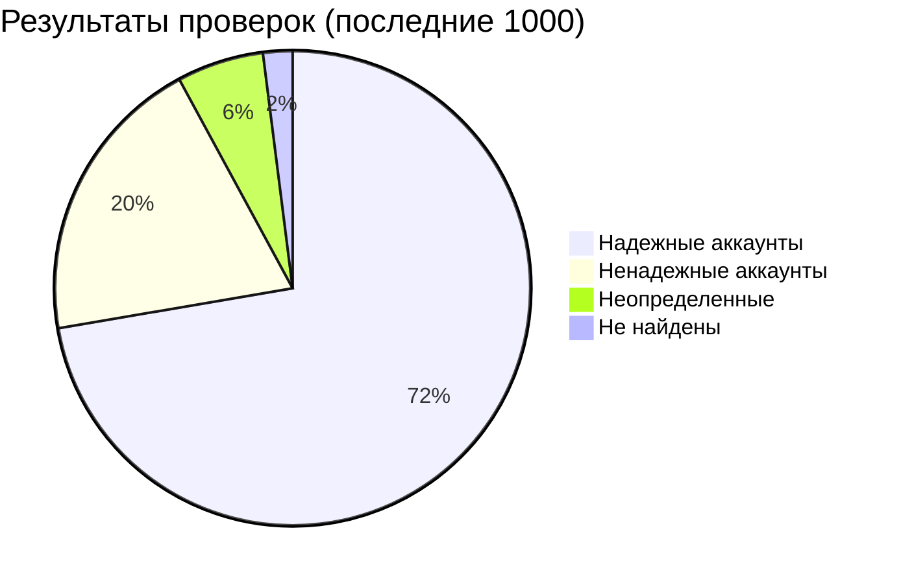

# Телеграм Чекер

## О проекте

Телеграм Чекер — это комплексная система анализа профилей Telegram для обеспечения безопасного цифрового взаимодействия и предотвращения мошеннических действий. Приложение позволяет проверять аккаунты Telegram на предмет их надежности, используя различные методы верификации и анализа данных.

## Функциональные возможности

- Авторизация через официальный API Telegram
- Многоуровневая проверка аккаунтов на надежность
- Детальный анализ профилей с рекомендациями
- Интуитивно понятный пользовательский интерфейс
- Защита персональных данных пользователей

## Архитектура системы

## Процесс верификации аккаунта

## Компоненты системы

## Статистика проверок

## Установка и запуск

1. Клонируйте репозиторий
2. Установите зависимости из файла requirements.txt
3. Запустите приложение командой `streamlit run app.py`

## Требования

- Python 3.8 или выше
- Streamlit
- Telethon
- API ключи Telegram (получите их на https://my.telegram.org)

## Лицензия

© 2023 Все права защищены. Версия 2.1.0
